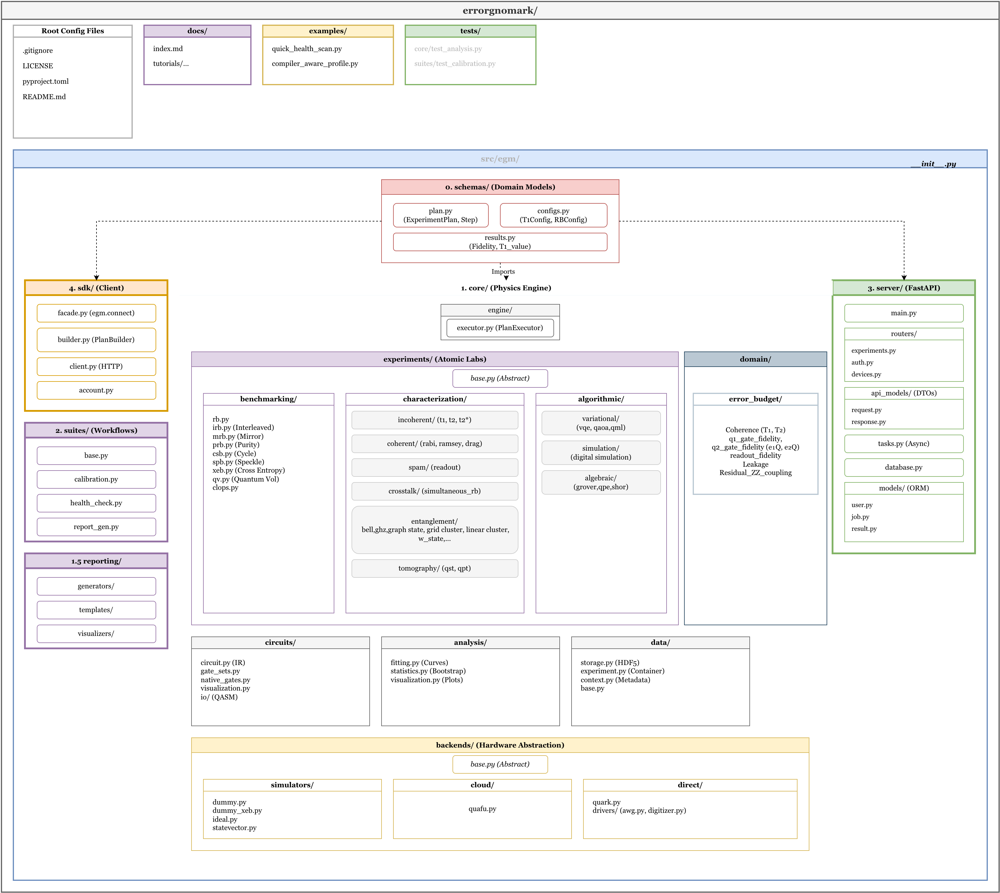

# EGM 开发思路整理文档
*** 以下文档并未根据严谨严密逻辑完成，根据目前开发实际脉络整理***
## 一、 EGM-整体研发规划 @Chai

### 1. 整体结构/架构最近再过一遍，从工程架构/软件开发视角整体上审视一遍 @Chai

我目前不太确信的点：
1) emg/core 层整体上比较清晰-因为和sisq 对接经验反馈-budget
i. core 层的能力边界/工程规范/可视化等优化方向

2) domain 层基本清晰，需要再次确信这样设计这个结构，就是介于core-suites 是否合理？
3) suite 层，除了目前正在开展的 compile层，calibration + other  模块是什么呢？我还没想的很清楚
4) server + sdk 我还没想的很清楚
5) 这样整体上还是需要再整体想一下

### 2. EGM-JSBS- 研发和当前所有研发进度适配及将来整合计划-这个为主线但不是全部落脚点 @Chai
目前开发路线太分散，整合/功能迁移/版本管理成本非常高，需要思考一下几个问题，让整个project 比较合一

### 3. 和sisq 等不同路径研发进展结构化进egm-形成高效dynamics @Chai

3.1  sisq-egm 研发和egm 整体研发步骤怎么高效match @Chai
3.2 egm-编译研发和egm 整体研发步骤怎么高效match @Chai
3.3 egm-quark 部署 整体研发步骤怎么高效match @Chai

### 4. 人力分配-DYNAMICS 

@星言 @科锐@ 清源 实习结束需要提交一份完整的实习报告-请大家提前准备

## 二、 EGM-JBGS @Chai@ 婕

### 1. EGM-JBGS 整体研发思路整理@Chai@ 婕

i. 继续调研根据工信部-JBGS- 项目指标/涉及单位...及egm 的最终汇报验收目标/指标是？-目前应不是非常明确

ii. 深度调研国内外 egm 相关所有软件项目-完善之前版本-清晰egm 定位

iii. benchmark 标准化问题-怎么体现在egm 中呢？

iv. 想清楚 JBGS -egm 关系,两年之后,egm 发展目标-可以思考 ppt 怎么做帮助结构化

### 2. EGM-JBGS 工程实施 @Chai @ 婕

i. 产品化设计-调研这方面整体-软开领域标准规范-将来要以此作为规范推进

ii. 架构设计-再过一遍-指向JBGS-验收目标

iii. 以这个视角-怎么整合目前开展的这几个模块-需要想清楚

## 三、 EGM-sisq  @Chai @清源 @科锐

### 1. sisq import egm.core 

1) 继续沿用egm.core.circutis.circuit @Chai
   
   i. TODO: gate decomposition逻辑是否需要分出来放在另外一个py 脚本
   
   ii. TODO: qubit-meta-j "qubit index & string"-逻辑处理
   
   iii. 明确egm.core.circutis.circuit的能力/功能边界

2) egm.core.experiments.benchmarking.py @清源

   i. def generate_rb_single_circuit

   ii. def generate_rb_circuits

   iii. class standard rb 最小体量workflow 测试

3) egm.core.analysis.rb @清源

   i. 封装 analyze_rb_data

4) egm.core.backends.@科锐

   i. emg2sisq converter 文件完成-打通 

5) egm.core 单元测试 @清源

   i.调研软开领域软件单元测试规范

   ii. egm.core 单元测试实现并交付 sisq

### 2. sisq-circuit-pulse 为基座研发  @Chai@科锐

0) 想清楚做这个的why? how? 需要注意的部分-

1) egm/core/domain/{error budget + error dignosis}-结构或者工作流设想 @Chai

i. emg 自身定位/功能边界/协作开发软件的注意事项 @Chai

1) 基于上面 3.4  **4) egm.core.backends.@科锐** 先深度了解egm-sisq @科锐

2) 以sisq 为特定backed呢-打通circuit 层级egm 工作流,i.e. rb 打通

3) 以sisq 为特定backed egm/core/domain/{error budget + error dignosis}

i. error budget  理论上应该不需要 pulse层面接口??调研一下

ii. error dignosis 诊断闭环-可以ai 赋能么？

## 四、 EGM-编译-qsteed @Chai @星言

1.  再过一遍egm-qsteed 实施方案/短期&长期交付目标-确定一个类似结构性- 
   @Chai -方案确定 @星言-工程架构图+实施；

2.  大致确定 @星言剩余实习-交付目标- 提前部署接手人

3.  明确 emg/suites/compile 最终理想形态-目前不是非常确定-最好可以短期可交付&兼容长期研发迭代

4.  如果基于现有技术可以实现或者解决 noise aware compilation 棘手问题，比如 测量或者预测 frequency drift, 可以考虑和宏泽合作做文章

## 五、 EGM-quark @Chai @ 婕

1. 基于上次 的 egm-quark- demo 需要做：

2. 整体风格需要调整，和quark 网页风格兼容 @Chai

3. egm-quark 长期合作的目标？短期交付&长期研发迭代兼容@Chai

4. 挖掘一下，目前第一版本展示什么？why?how? what？@Chai

i. 量子经典异构benchmark？？会考虑么

ii. 提前思考 compile加进来与否的benchmark性能-这里提前思考量子计算机整机benchmark结构和标准化问题-需调研和深度思考

iii. algorithm-qec 会有类似 mid-circuit 能力问题，类似这种的，我的意思整体这个方向的生态是什么？需要都搞清楚

iv. 量子云平台本身benchmark 需要考虑么？jbgs 相关单位提过这个事情-需要思考-目前的确有这个条件做-不过他们那边肯定在做

5. egm 集成 quark 或者将来其他方式合作，对egm 的价值是什么呢？egm-jbgs 可以讲的？
6. egm/core 基础组件除了在sisq 推广部署，有可能将来在quark 等部署测试么？